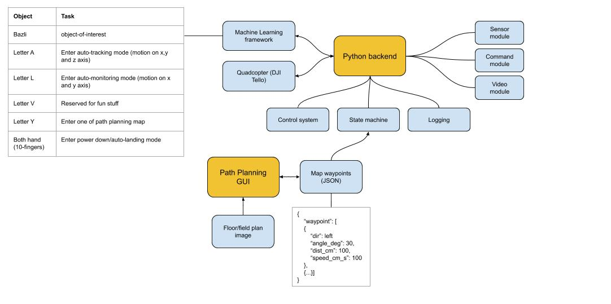

# PROJECT TELLO AI

## Background
This is Tello AI project from RobotAndCode youtube channel. It contains
basic SDK implementation based on Ryze documentation at [Tello SDK Document](https://dl-cdn.ryzerobotics.com/downloads/Tello/Tello%20SDK%202.0%20User%20Guide.pdf).

## System Overview


## Code Structure
```
.
├── README.md
├── component-diagram.jpg   <-- Big picture component diagram
├── image.png               <-- Map being used for Path Planning GUI
├── path-plan.py            <-- Path Planning GUI program
├── tello-command.py        <-- Basic Tello's SDK command
├── tello-state.py          <-- Basic Tello's SDK sensor state
└── tello-stream.py         <-- Basic Tello's SDK video stream
```

## Youtube Channel
Checkout my youtube channel [RobotAndCode](https://www.youtube.com/channel/UCQam-u9KZaMSelXoJDRrYJA?view_as=subscriber) for more exciting robot and code projects.

## Software Installation
This section describe required packages and software for D450 project.

### Pre-requisite packages
1. Python3
2. PIP3
3. numpy
4. matplotlib

### OpenCV

### Installation on Windows
Below are the packages and software required to install OpenCV in Windows platform.

#### Install OpenCV from Pre-Built Binary  
   1. Download OpenCV release from [Github](https://github.com/opencv/opencv/releases/download/4.5.0/opencv-4.5.0-dldt-2021.1-vc16-avx2.zip)  
   2. Unzip & copy cv2.pyd to C:/Python39/lib/site-packages  
   3. Details [installation guide](https://docs.opencv.org/master/d5/de5/tutorial_py_setup_in_windows.html) available here  
   4. Done!  

#### Install OpenCV from Source Code  
   1. Install Microsoft Visual Studio  
   2. Install Microsoft Visual C++ (MSVC) compiler  
   3. Download OpenCV source code from [Github](https://github.com/opencv/opencv/archive/4.5.0.zip)
   4. Install Cmake
   5. Build OpenCV source code using Cmake
   6. Open OpenCV.sln project in MS Visual Studio
   7. Right-click ALL_BUILD and build it as Release
   8. Right-click INSTALL and build it
   9. Details [installation guide](https://docs.opencv.org/master/d5/de5/tutorial_py_setup_in_windows.html) available here
   10. Done!

### Installation on Ubuntu
Below are the packages and software required to install OpenCV in Ubuntu platform.

1. apt install python3-opencv libopencv-dev libopencv-core-dev
2. pip3 install opencv-python